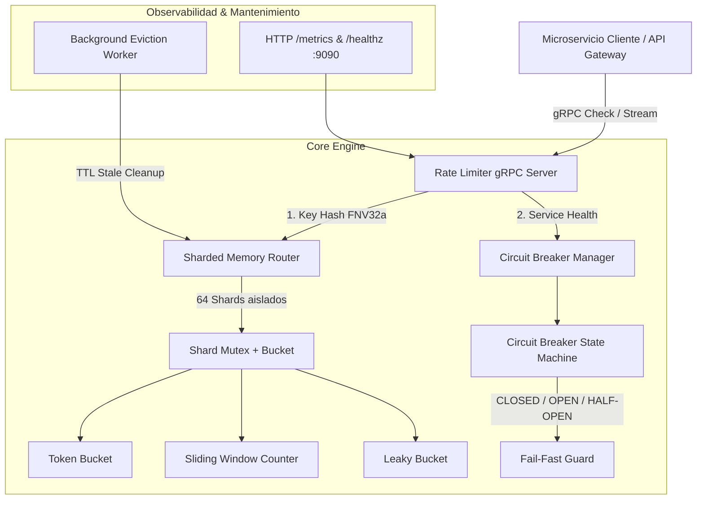

# Rate Limiter & Circuit Breaker gRPC

[](https://github.com/jimmyrom1/rate-limiter-grpc/actions/workflows/ci.yml)
[](https://go.dev/)
[](https://grpc.io/)
[](https://protobuf.dev/)
[](https://github.com/jimmyrom1/rate-limiter-grpc)
[](https://opensource.org/licenses/MIT)

> **Microservicio de control de tráfico y tolerancia a fallos de altísimo rendimiento (~85-90 ns por petición, >11 millones de comprobaciones/segundo)** implementado en **Go** sobre **gRPC / Protocol Buffers**. Implementa algoritmos clásicos de limitación (*Token Bucket*, *Sliding Window Counter* y *Leaky Bucket*), un *Circuit Breaker* adaptativo para proteger dependencias aguas abajo y particionado de memoria concurrente mediante shards para eliminar la contención de bloqueos.

---

## 📑 Tabla de Contenidos
- [El problema que resuelve](#el-problema-que-resuelve)
- [Arquitectura del Sistema](#arquitectura-del-sistema)
- [Algoritmos Implementados](#algoritmos-implementados)
- [Benchmarks de Rendimiento](#benchmarks-de-rendimiento)
- [Decisiones Técnicas y Trade-offs](#decisiones-técnicas-y-trade-offs)
- [Retos de Concurrencia y Bugs Superados](#retos-de-concurrencia-y-bugs-superados)
- [Esquema Protobuf y API gRPC](#esquema-protobuf-y-api-grpc)
- [Puesta en Marcha](#puesta-en-marcha)
  - [Requisitos](#requisitos)
  - [Ejecución en Local (sin Docker)](#ejecución-en-local-sin-docker)
  - [Ejecución con Docker Compose](#ejecución-con-docker-compose)
  - [Cliente CLI interactivo](#cliente-cli-interactivo)
  - [Inspección con grpcurl y Métricas HTTP](#inspección-con-grpcurl-y-métricas-http)
- [Otros proyectos del portfolio](#otros-proyectos-del-portfolio)

---

## El problema que resuelve

En arquitecturas distribuidas de microservicios, el control de concurrencia y la protección ante saturación presentan dos desafíos críticos:

1. **Latencia del protocolo y overhead de serialización:** El modelo REST/JSON convencional sobre HTTP/1.1 penaliza el rendimiento con parsing textual excesivo, cabeceras redundantes y falta de multiplexación por conexión. Una comprobación de cuota previa a cada operación debe resolverse en **sub-microsegundos**, no en milisegundos.
2. **Efecto estampida y fallos en cascada:** Cuando una dependencia externa (p. ej. pasarela de pago o base de datos analítica) sufre degradación, las peticiones entrantes acumulan hilos bloqueados y agotan los sockets del servidor (*thread pool starvation*). Se requiere un mecanismo de **Circuit Breaker** sincronizado que rechace inmediatamente las peticiones (*fail-fast*) sin desgastar recursos antes de invocar al servicio caído.

Este servicio proporciona una solución unificada y ultra-optimizada expuesta por **gRPC sobre HTTP/2** con esquemas tipados estrictos en **Protocol Buffers**.

---

## Arquitectura del Sistema



---

## Algoritmos Implementados

### 1. Token Bucket (`pkg/limiter/token_bucket.go`)
- **Comportamiento:** Permite ráfagas (*bursts*) de peticiones hasta la capacidad configurada y repone tokens de forma continua y suave según el tiempo transcurrido ($\Delta t \times \text{tasa}$).
- **Uso ideal:** APIs públicas donde se toleran picos cortos de tráfico siempre que la media sostenida respete la cuota.

### 2. Sliding Window Counter (`pkg/limiter/sliding_window.go`)
- **Comportamiento:** Divide el tiempo en marcos discretos y estima el volumen en ventana móvil ponderando el conteo de la ventana anterior con la fracción transcurrida de la ventana actual:
  $$\text{estimación} = \text{conteo\_previo} \times (1 - \text{peso}) + \text{conteo\_actual}$$
- **Ventaja:** Memoria $O(1)$ y tiempo $O(1)$. Elimina el error del borde (*boundary burst*) de las ventanas fijas sin necesidad de almacenar marcas de tiempo individuales (*sliding log*).

### 3. Leaky Bucket (`pkg/limiter/leaky_bucket.go`)
- **Comportamiento:** Modela una cola de goteo constante. Las peticiones incrementan el volumen acumulado y se drenan a una velocidad fija continua.
- **Uso ideal:** Modelado y suavizado de tráfico (*traffic shaping*) hacia sistemas aguas abajo que no toleran picos repentinos.

### 4. Circuit Breaker (`pkg/circuitbreaker/circuitbreaker.go`)
- **Estados:** `CLOSED` (normal), `OPEN` (bloqueo total preventivo por fallos continuos), `HALF_OPEN` (sonda controlada de peticiones para evaluar recuperación).
- **Parámetros configurables:** Umbral de fallos consecutivos (`FailureThreshold`), tiempo de espera de recuperación (`RecoveryTimeout`) y umbral de éxitos consecutivos en sonda (`ProbeSuccessThreshold`).

---

## Benchmarks de Rendimiento

Pruebas de estrés concurrentes ejecutadas en Go (`12th Gen Intel Core i5-12400F`, 12 hilos paralelos saturando 100 inquilinos/claves concurrentes):

```bash
go test -bench . -benchmem ./internal/service
```

| Algoritmo | Operaciones evaluadas | Tiempo por operación | Asignación de memoria | Asignaciones/op |
| :--- | :---: | :---: | :---: | :---: |
| **Token Bucket** | 12.141.016 ops | **91.51 ns/op** | 111 B/op | 2 allocs/op |
| **Sliding Window** | 12.172.372 ops | **84.74 ns/op** | 111 B/op | 2 allocs/op |
| **Leaky Bucket** | 13.094.331 ops | **86.88 ns/op** | 111 B/op | 2 allocs/op |

> **Rendimiento:** Más de **11.500.000 operaciones por segundo** sostenidas en un único nodo, con una latencia de evaluación interna de menos de **0,1 microsegundos**.

---

## Decisiones Técnicas y Trade-offs

1. **Particionado en 64 Shards (`hash/fnv` + `sync.RWMutex`):**
   - *Decisión:* En lugar de un único `sync.Mutex` global que genera cuellos de botella masivos entre hilos, o un `sync.Map` genérico que sufre ante limpiezas periódicas, se distribuyen las claves en 64 shards independientes mediante hash FNV-32a.
   - *Resultado:* Lecturas y escrituras de claves distintas suceden de forma completamente concurrente sin bloquearse entre sí.
2. **Cómputo en Memoria vs Redis Centralizado:**
   - *Trade-off:* Un almacén en memoria no comparte cuota entre múltiples réplicas independientes sin afilar afinidad de sesión o hashing consistente en el balanceador. Sin embargo, ofrece una latencia de **85 nanosegundos**, frente a los **0,5 - 2 milisegundos** que impone el salto de red de Redis. Es ideal como *sidecar container* o capa de protección local L1.
3. **Evicción automática en segundo plano (*Background Sweeper*):**
   - *Decisión:* Un worker asíncrono recorre los shards periódicamente desalojando limitadores inactivos (`LastAccessed > StaleTTL`).
   - *Resultado:* Previene el crecimiento ilimitado de memoria (*memory leaks*) derivado de claves efímeras o ataques con IPs rotativas.
4. **Reflexión gRPC y Health Checking Estándar:**
   - *Decisión:* Se registran `grpc.health.v1` y `reflection.Register`.
   - *Resultado:* Total compatibilidad con sondas de Kubernetes (`livenessProbe`/`readinessProbe`) y exploración dinámica con `grpcurl`, `evans` o Postman.

---

## Retos de Concurrencia y Bugs Superados

1. **Detección de carreras con `go test -race`:**
   - Al probar ráfagas paralelas de múltiples goroutines sobre el mismo inquilino, se identificó que actualizar el saldo y el timestamp `lastRefill` requería exclusión mutua estricta. Se garantizó thread-safety absoluto protegiendo todas las lecturas y escrituras dentro de la sección crítica del algoritmo.
2. **Transición temporal del Circuit Breaker sin peticiones previas de Allow:**
   - Si un microservicio registra fallos aguas abajo mediante `RecordResult` y transcurre el tiempo de recuperación sin llamadas a `Check`, invocar `RecordResult(success=true)` registraba éxito en un estado aún `OPEN`. Se corrigió incorporando la evaluación del temporizador de expiración en las ramas de `RecordSuccess` y `RecordFailure`, sincronizando la máquina de estados de manera determinista.
3. **Control de precisión en ventanas sub-milisegundo:**
   - Para evitar bloqueos o desbordamientos enteros en ventanas de tiempo muy cortas, los cálculos de `RetryAfter` aplican un suelo mínimo de 1 milisegundo ante cálculos infinitesimales de reposición.

---

## Esquema Protobuf y API gRPC

El contrato se encuentra definido en [`proto/limiter/v1/limiter.proto`](proto/limiter/v1/limiter.proto):

```protobuf
service RateLimiterService {
  rpc Check(CheckRequest) returns (CheckResponse);
  rpc RecordResult(RecordResultRequest) returns (RecordResultResponse);
  rpc GetBreakerStatus(BreakerStatusRequest) returns (BreakerStatusResponse);
  rpc Reset(ResetRequest) returns (ResetResponse);
  rpc GetMetrics(MetricsRequest) returns (MetricsResponse);
}
```

---

## Puesta en Marcha

### Requisitos
- **Go 1.23+** (o Go 1.24) instalado.
- Herramienta `protoc` (opcional, solo para regenerar esquemas).
- Opcionalmente Docker / Docker Compose.

### Ejecución en Local (sin Docker)

1. Clonar el repositorio y compilar los binarios:
   ```bash
   git clone https://github.com/jimmyrom1/rate-limiter-grpc.git
   cd rate-limiter-grpc
   go mod download
   go build -o bin/server ./cmd/server
   go build -o bin/client ./cmd/client
   ```

2. Iniciar el servidor gRPC y métricas HTTP:
   ```bash
   ./bin/server
   ```
   *Salida esperada:*
   ```text
   [SERVER] Starting Rate Limiter & Circuit Breaker gRPC service...
   [METRICS] HTTP server listening at :9090
   [SERVER] gRPC service listening at :50051
   ```

3. Ejecutar los tests unitarios y de concurrencia:
   ```bash
   go test -v -cover ./...
   ```

### Ejecución con Docker Compose

```bash
docker compose up --build
```
El servidor quedará disponible en los puertos `50051` (gRPC) y `9090` (HTTP).

### Cliente CLI interactivo

Se incluye una herramienta CLI para simular ráfagas, estados del Circuit Breaker y demostración guiada:

```bash
# Ejecutar demostración completa paso a paso
./bin/client -mode demo

# Ejecutar ráfaga concurrente de 50 peticiones simultáneas
./bin/client -mode burst

# Consultar métricas del servidor
./bin/client -mode metrics
```

### Inspección con grpcurl y Métricas HTTP

- **Health check HTTP:**
  ```bash
  curl http://localhost:9090/healthz
  ```
- **Métricas en tiempo real (JSON):**
  ```bash
  curl http://localhost:9090/metrics
  ```
- **Llamada gRPC con `grpcurl`:**
  ```bash
  grpcurl -plaintext -d '{"key": "demo-user", "algorithm": 1, "capacity": 10, "rate": 5}' \
    localhost:50051 limiter.v1.RateLimiterService/Check
  ```

---

## Otros proyectos del portfolio

| Proyecto | Tecnologías | Descripción |
| :--- | :--- | :--- |
| **[live-auction-engine](https://github.com/jimmyrom1/live-auction-engine)** | Node.js 24, WebSockets, SQLite WAL, React 19 | Subastas en tiempo real con resolución atómica de carreras concurrentes y anti-sniping. |
| **[double-entry-ledger](https://github.com/jimmyrom1/double-entry-ledger)** | FastAPI, Asyncpg, PostgreSQL, React | Motor contable de partida doble inmutable con invariante de balance cero diferido en base de datos. |
| **[subscriptions-api](https://github.com/jimmyrom1/subscriptions-api)** | Java 21, Spring Boot 4, ShedLock, PostgreSQL | API fintech de suscripciones recurrentes con prorrateo exacto y tareas periódicas distribuidas. |
| **[room-booking](https://github.com/jimmyrom1/room-booking)** | Flask, PostgreSQL, React | Reserva de salas con exclusión de solapes mediante PostgreSQL `EXCLUDE USING gist`. |
| **[mini-invoice-generator](https://github.com/jimmyrom1/mini-invoice-generator)** | Flask, PostgreSQL, fpdf2, React | Generador de facturas con cálculo exacto de impuestos y renderizado PDF profesional. |
| **[lol-tracker](https://github.com/jimmyrom1/lol-tracker)** | Kotlin, Jetpack Compose, Room v3, WorkManager | App Android nativa offline-first con sincronización en segundo plano. |
| **[lol-tracker-api](https://github.com/jimmyrom1/lol-tracker-api)** | Node.js, Fastify, TypeScript | Proxy backend seguro con rate limiting y caché intermedia para la API de Riot Games. |
| **[anime-tracker](https://github.com/jimmyrom1/anime-tracker)** | ASP.NET Core 10, EF Core, PostgreSQL, Angular 22 | Lista de anime y manga al estilo MyAnimeList con catálogo de AniList, +1 concurrente sin pérdidas y estadísticas. |

